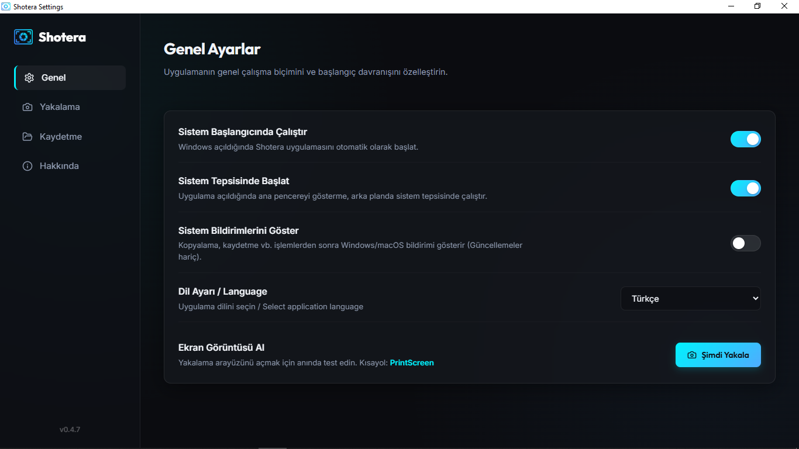
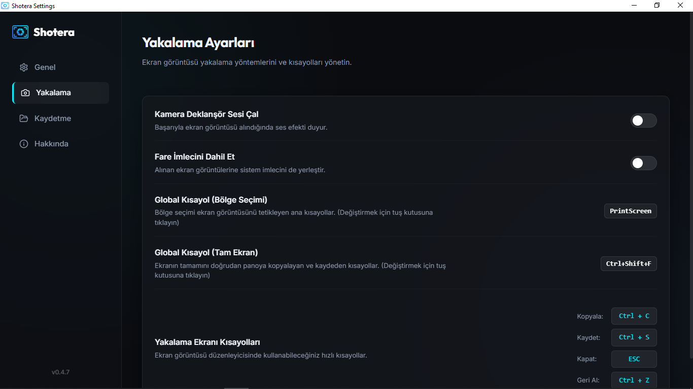
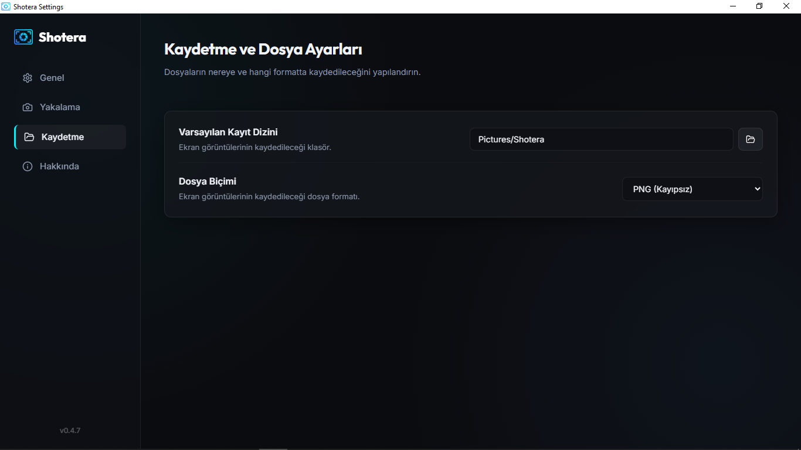
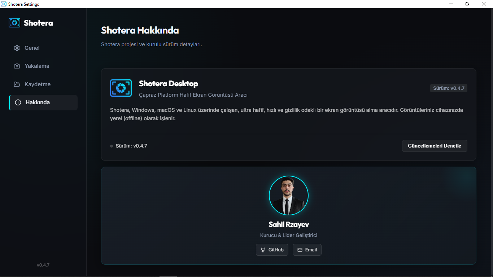

  
  <h1 align="center">Shotera</h1>

  🌐 <strong>Official Website:</strong> <a href="https://rzayevsahil.github.io/Shotera/">https://rzayevsahil.github.io/Shotera/</a>

  <a href="#türkçe">🇹🇷 Türkçe</a> | <a href="#english">🇬🇧 English</a> | <a href="#azerbaycan">🇦🇿 Azərbaycan dili</a>

---

<h2 id="türkçe">🇹🇷 Türkçe</h2>

  <strong>Modern, Hızlı ve Şık Tasarımlı Ekran Yakalama Uygulaması</strong>

  

### 🌟 Nedir?

**Shotera**, Tauri, React ve Rust kullanılarak geliştirilmiş, düşük kaynak tüketimi ve modern tasarımıyla öne çıkan bir ekran yakalama aracıdır. Standart ekran görüntüsü alma deneyimini gelişmiş özellikler (buluta yükleme, ekrana sabitleme vb.) ile birleştirerek üretkenliğinizi artırmayı hedefler.

### ✨ Temel Özellikler

- 📸 **Bölgesel ve Tam Ekran Yakalama:** Ekranın istediğiniz bir bölümünü veya tamamını hızlıca kaydedin.
- 📌 **Ekrana Sabitleme (Pin):** Aldığınız ekran görüntülerini ekranın herhangi bir yerinde, diğer pencerelerin üzerinde "her zaman üstte" (always-on-top) kalacak şekilde sabitleyin. Referans görsellerle çalışırken çok kullanışlıdır.
- ☁️ **Hızlı Bulut Yükleme:** Ekran görüntülerini tek tıkla Imgur'a yükleyin ve bağlantısını anında panoya (clipboard) kopyalayın.
- ⚙️ **Özelleştirilebilir Kısayollar:** Global klavye kısayollarını kendi çalışma alışkanlıklarınıza göre kişiselleştirin.
- 💾 **Çoklu Format Desteği:** Ekran görüntülerinizi PNG, JPG veya modern WebP formatlarında, belirlediğiniz kalite ayarlarıyla kaydedin.
- 🌍 **Çoklu Dil Desteği:** Türkçe (TR), İngilizce (EN) ve Azərbaycan dili (AZ) dil seçenekleri.
- 🔄 **Otomatik Güncelleme:** Uygulama içinden tek tıkla yeni sürümleri kontrol edin ve yükleyin.
- 🚀 **Arka Planda Çalışma (Oto-Başlatma):** İşletim sistemiyle birlikte başlar ve sistem tepsisinde sessizce görevini yapmaya hazır bekler.
- 🔍 **Metin Tanıma (OCR):** Ekrandaki kopyalanamayan yazıları tek tıkla okuyun ve metin olarak panoya kopyalayın (Tesseract WebAssembly ile tamamen internetsiz çalışır).
- 🔢 **Adım Sayacı (Tutorial Modu):** Ekrana tıkladıkça 1, 2, 3 şeklinde otomatik artan numaralar ekleyin. Eğitim ve rehber görselleri hazırlamak için birebir!

  
  
   
  
  
   
   
  

### 📥 İndirme ve Kurulum

Uygulamayı indirmek ve kullanmaya başlamak çok kolaydır:

1. **Resmi Web Sitesi & İndirme:** Uygulamayı **[Shotera Resmi Web Sitesi](https://rzayevsahil.github.io/Shotera/)** veya GitHub **[Releases (Sürümler)](https://github.com/rzayevsahil/Shotera/releases/latest)** sayfası üzerinden işletim sisteminize uygun (`.exe`, `.msi`, `.dmg`, `.deb`, `.AppImage`) kurulum dosyasını doğrudan indirebilirsiniz.
2. Dosyayı çalıştırıp kurulumu tamamlayın.
3. Sistem tepsisinde (sağ alt köşede) yer alan Shotera ikonuna tıklayarak veya belirlediğiniz kısayol tuşlarını kullanarak hemen ekran görüntüsü almaya başlayabilirsiniz!

### ⌨️ Varsayılan Kısayollar

- **Bölgesel Ekran Görüntüsü:** `Ctrl` + `Shift` + `S`
- **Tam Ekran Görüntüsü:** `Ctrl` + `Shift` + `F`

*(Bu kısayolları uygulamanın "Ayarlar" menüsünden dilediğiniz gibi değiştirebilirsiniz.)*

### 🧑‍💻 Geliştiriciler İçin

Bu projenin geliştirme ve build (derleme) adımları ile ilgili talimatlar proje içindeki geliştirici notlarında yer almaktadır. Projeye katkıda bulunmak isteyenler için temel gereksinimler **Tauri v2, Rust ve Node.js**'tir.

---

<h2 id="english">🇬🇧 English</h2>

  <strong>Modern, Fast, and Elegant Screen Capture Application</strong>

  

### 🌟 What is it?

**Shotera** is a screen capture tool built using Tauri, React, and Rust, distinguished by its low resource consumption and modern design. It aims to boost your productivity by combining the standard screenshot experience with advanced features such as cloud uploading and screen pinning.

### ✨ Key Features

- 📸 **Region & Full-Screen Capture:** Quickly record a specific region or the entire screen.
- 📌 **Screen Pinning:** Pin your screenshots anywhere on your screen as "always-on-top" windows. Highly useful when working with reference images.
- ☁️ **Quick Cloud Upload:** Upload screenshots to Imgur with a single click and instantly copy the link to your clipboard.
- ⚙️ **Customizable Shortcuts:** Personalize global keyboard shortcuts to match your workflow.
- 💾 **Multi-Format Support:** Save your screenshots in PNG, JPG, or modern WebP formats with adjustable quality settings.
- 🌍 **Multi-Language Support:** Available in English (EN), Turkish (TR), and Azerbaijani (AZ).
- 🔄 **Auto-Updater:** Check for and install new updates with one click from within the app.
- 🚀 **Background Execution (Auto-Start):** Launches automatically with your operating system and waits quietly in the system tray, ready for use.
- 🔍 **Text Recognition (OCR):** Extract text from uncopyable areas on your screen with a single click and copy it as text (Powered by Tesseract WebAssembly, works completely offline).
- 🔢 **Step Counter (Tutorial Mode):** Click on the screen to add auto-incrementing numbers (1, 2, 3...). Perfect for creating educational and guide images!

  
  
   
  
  
   
   
  

### 📥 Download & Installation

Getting started is extremely simple:

1. **Website & Direct Download:** Download the appropriate installer (`.exe`, `.msi`, `.dmg`, `.deb`, `.AppImage`) directly from the **[Official Shotera Website](https://rzayevsahil.github.io/Shotera/)** or from the **[GitHub Releases Section](https://github.com/rzayevsahil/Shotera/releases/latest)**.
2. Run the installer to complete the setup.
3. You can immediately start taking screenshots by clicking the Shotera icon in your system tray (bottom-right corner) or by using your assigned shortcut keys!

### ⌨️ Default Shortcuts

- **Region Capture:** `Ctrl` + `Shift` + `S`
- **Full-Screen Capture:** `Ctrl` + `Shift` + `F`

*(You can easily modify these shortcuts from the "Settings" menu inside the application.)*

### 🧑‍💻 For Developers

Development and build instructions are documented in the internal developer notes of the project. If you wish to contribute to the project, the primary prerequisites are **Tauri v2, Rust, and Node.js**.

---

<h2 id="azerbaycan">🇦🇿 Azərbaycan dili</h2>

  <strong>Müasir, Sürətli və Zərif Ekran Yaxalama Tətbiqi</strong>

  

### 🌟 Bu Nədir?

**Shotera**, Tauri, React və Rust texnologiyalarından istifadə edilərək hazırlanmış, aşağı resurs istifadəsi və müasir dizaynı ilə seçilən ekran şəkli alma alətidir. Standart ekran şəkli alma təcrübəsini inkişaf etdirilmiş imkanlarla (buluda yükləmə, ekrana sancma və s.) birləşdirərək məhsuldarlığınızı artırmağı hədəfləyir.

### ✨ Əsas Xüsusiyyətlər

- 📸 **Bölmə və Tam Ekran Yaxalama:** Ekranın istədiyiniz bir hissəsini və ya tamamını sürətlə yaxalayın.
- 📌 **Ekrana Sancma (Pin):** Aldığınız ekran şəkillərini ekranın hər hansı bir yerində, digər pəncərələrin üzərində "həmişə üstdə" (always-on-top) qalacaq şəkildə sancın. Kod yazarkən və ya dizayn edərkən baxış üçün mükəmməldir.
- ☁️ **Sürətli Bulud Yükləməsi:** Ekran şəkillərini tək kliklə Imgur-a yükləyin və keçidini anında mübadilə buferinə (clipboard) kopyalayın.
- ⚙️ **Fərdiləşdirilə Bilən Qısayollar:** Qlobal klaviatura qısayollarını öz iş vərdişlərinizə uyğunlaşdırın.
- 💾 **Çoxlu Format Dəstəyi:** Ekran şəkillərinizi PNG, JPG və ya müasir WebP formatında, təyin etdiyiniz keyfiyyət tənzimləmələri ilə yadda saxlayın.
- 🌍 **Çoxlu Dil Dəstəyi:** Azərbaycan dili (AZ), Türk dili (TR) və İngilis dili (EN) dəstəyi.
- 🔄 **Avtomatik Yenilənmə:** Tətbiq daxilindən tək kliklə yeni versiyaları yoxlayın və quraşdırın.
- 🚀 **Arka Fonda Çalışma (Avto-Başlatma):** Əməliyyat sistemi ilə birlikdə başlayır və sistem treyində səssizcə işləməyə hazır gözləyir.
- 🔍 **Mətn Tanıma (OCR):** Ekrandakı kopyalanmayan yazıları tək kliklə oxuyun və mətn olaraq mübadilə buferinə kopyalayın (Tesseract WebAssembly ilə tamamilə internetsiz çalışır).
- 🔢 **Adım Sayğacı (Dərslik Rejimi):** Ekrana kliklədikcə 1, 2, 3 şəklində avtomatik artan nömrələr əlavə edin. Təlimat və bələdçi şəkilləri hazırlamaq üçün mükəmməldir!

### 📥 Yükləmə və Quraşdırma

Tətbiqi yükləmək və istifadəyə başlamaq çox asandır:

1. **Rəsmi Veb Sayt və Birbaşa Yükləmə:** Tətbiqi **[Shotera Rəsmi Veb Saytı](https://rzayevsahil.github.io/Shotera/)** və ya GitHub üzərindəki **[Buraxılışlar (Releases)](https://github.com/rzayevsahil/Shotera/releases/latest)** bölməsindən əməliyyat sisteminizə uyğun quraşdırma faylını (`.exe`, `.msi`, `.dmg`, `.deb`, `.AppImage`) birbaşa endirə bilərsiniz.
2. Faylı çalışdırıb quraşdırmanı tamamlayın.
3. Sistem treyində (sağ aşağı küncdə) yerləşən Shotera ikonuna klikləyərək və ya təyin etdiyiniz qısayol düymələrindən istifadə edərək dərhal ekran şəkli almağa başlaya bilərsiniz!

### ⌨️ Defolt Qısayollar

- **Bölmə Ekran Şəkli:** `Ctrl` + `Shift` + `S`
- **Tam Ekran Şəkli:** `Ctrl` + `Shift` + `F`

*(Bu qısayolları tətbiqin "Tənzimləmələr" menyusundan istədiyiniz kimi dəyişə bilərsiniz.)*

### 🧑‍💻 Tərtibatçılar Üçün

Bu layihənin inkişaf etdirilməsi və derlənmə (build) addımları ilə bağlı təlimatlar layihə daxilindəki tərtibatçı qeydlərində yer alır. Layihəyə töhfə vermək istəyənlər üçün əsas tələblər **Tauri v2, Rust və Node.js**-dir.

---

  Built with love ❤️

