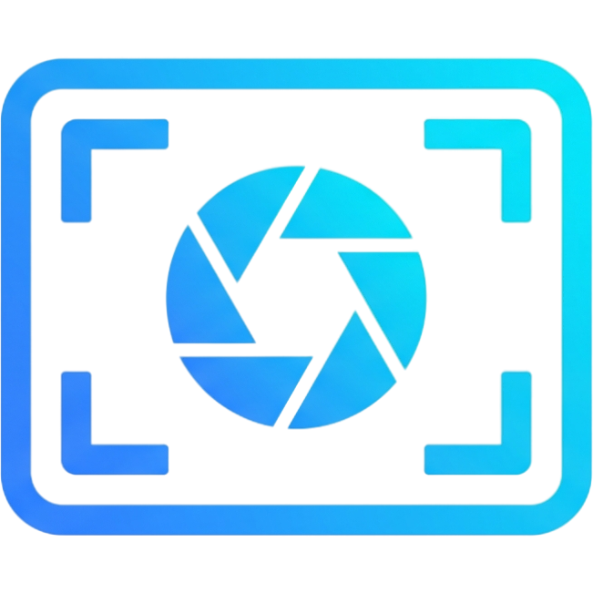
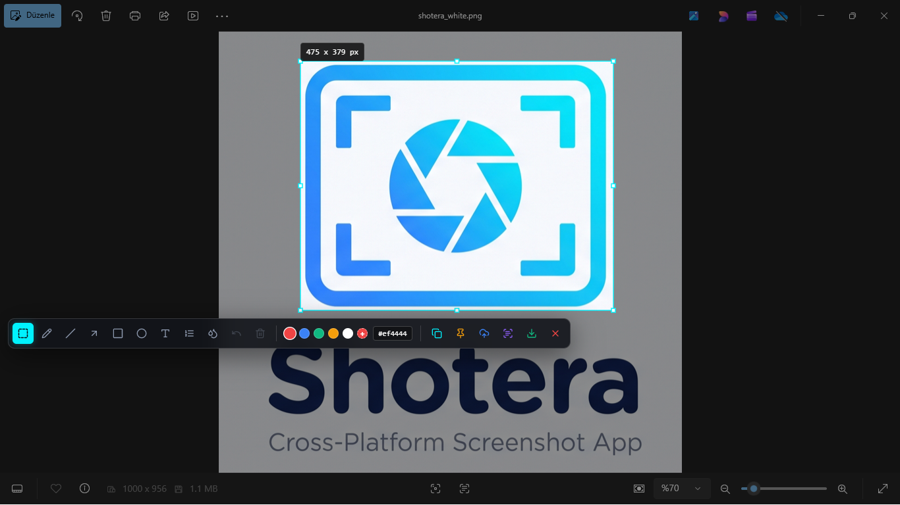
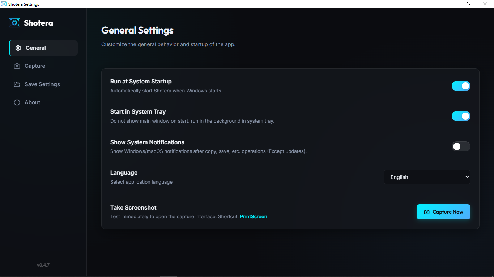
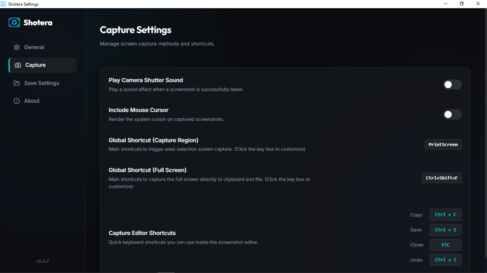
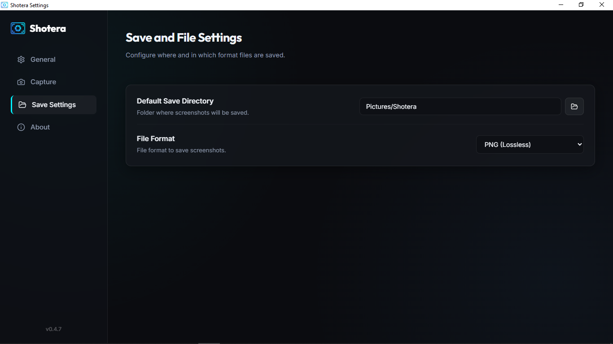
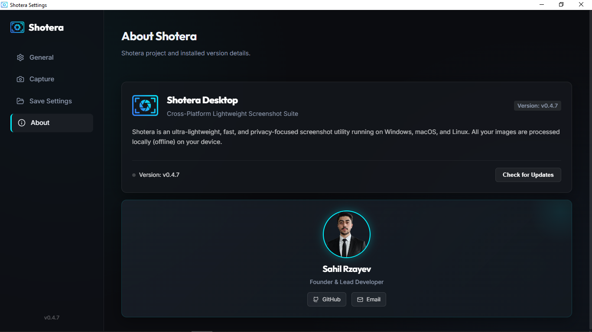
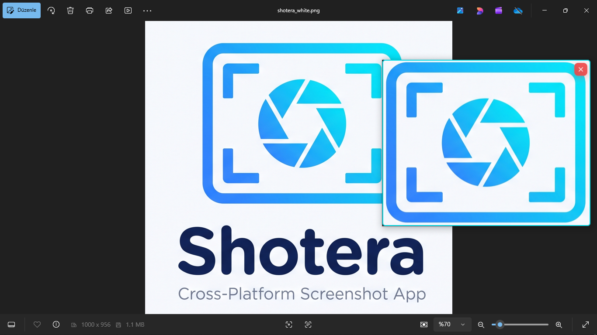

  
  <h1 align="center">Shotera</h1>

  🌐 <strong>Official Website:</strong> <a href="https://rzayevsahil.github.io/Shotera/">https://rzayevsahil.github.io/Shotera/</a>

  <strong>🇬🇧 English</strong> | <a href="docs/README_TR.md">🇹🇷 Türkçe</a> | <a href="docs/README_AZ.md">🇦🇿 Azərbaycan dili</a> | <a href="docs/README_RU.md">🇷🇺 Русский</a> | <a href="docs/README_DE.md">🇩🇪 Deutsch</a>

---

  <strong>Modern, Fast, and Elegant Screen Capture Application</strong>

  

### 🌟 What is it?

**Shotera** is a screen capture tool built using Tauri, React, and Rust, distinguished by its low resource consumption and modern design. It aims to boost your productivity by combining the standard screenshot experience with advanced features such as cloud uploading, screen pinning, and OCR text extraction.

### ✨ Key Features

- 📸 **Region & Full-Screen Capture:** Quickly record a specific region or the entire screen.
- 📌 **Screen Pinning:** Pin your screenshots anywhere on your screen as "always-on-top" windows. Highly useful when working with reference images or code snippets.
- 🔎 **Screen Zoom & Magnifier (ZoomIt Tool - `Ctrl` + `1`):** Freeze and magnify any part of your screen (1.0x - 5.0x), draw freehand, straight lines (`Shift`), rectangles (`Ctrl`), ovals (`Alt`), arrows (`Shift`+`Ctrl`), type bold text (`T`), and switch to instant whiteboard (`W`) or blackboard (`K`) modes with single-key color palette (`R`, `G`, `B`, `Y`, `O`, `P`).
- ⌛ **Break & Focus Timer (`Ctrl` + `3`):** Fullscreen presentation timer (1-99 minutes) with real-time countdown, animated progress ring/bar, play/pause controls, +1m/-1m time adjustments, and expiration audio alerts.
- ☁️ **Quick Cloud Upload:** Upload screenshots to Imgur with a single click and instantly copy the link to your clipboard.
- ⚙️ **Customizable Shortcuts:** Personalize global keyboard shortcuts to match your workflow.
- 💾 **Multi-Format Support:** Save your screenshots in PNG, JPG, or modern WebP formats with adjustable quality settings.
- 🌍 **Multi-Language Support (5 Locales):** Available in English (EN), Turkish (TR), Azerbaijani (AZ), Russian (RU), and German (DE).
- 🔄 **Auto-Updater:** Check for and install new updates with one click from within the app.
- 🚀 **Background Execution (Auto-Start):** Launches automatically with your operating system and waits quietly in the system tray, ready for use.
- 🔍 **Text Recognition (OCR):** Extract text from uncopyable areas on your screen with a single click and copy it as text (Powered by Tesseract WebAssembly, works completely offline).
- 🎨 **Rich Annotation Suite:** Draw freehand pencil lines, straight lines, pointing arrows, rectangles/squares, circles/ovals, and custom formatted text (Bold, Italic, Underline, Strikethrough) with a custom color palette.
- 💧 **Adjustable Blur Intensity:** Fine-tune region blur level with a live range slider (2px - 30px) and uniform edge-to-edge padding.
- 🔢 **Step Counter (Tutorial Mode):** Click on the screen to add auto-incrementing numbers (1, 2, 3...). Perfect for creating educational and guide images!

  
  
   
  
  
   
   
  

### 📥 Download & Installation

Getting started is extremely simple:

1. **Website & Direct Download:** Download the appropriate installer (`.exe`, `.msi`, `.dmg`, `.deb`, `.AppImage`) directly from the **[Official Shotera Website](https://rzayevsahil.github.io/Shotera/)** or from the **[GitHub Releases Section](https://github.com/rzayevsahil/Shotera/releases/latest)**.
2. Run the installer to complete the setup.
3. You can immediately start taking screenshots by clicking the Shotera icon in your system tray (bottom-right corner) or by using your assigned shortcut keys!

### ⌨️ Default Shortcuts

- **Region Capture:** `Ctrl` + `Shift` + `S`
- **Full-Screen Capture:** `Ctrl` + `Shift` + `F`
- **Screen Zoom & Magnifier (ZoomIt):** `Ctrl` + `1`
- **Break & Focus Timer:** `Ctrl` + `3`

*(You can easily modify these shortcuts from the "Settings" menu inside the application.)*

### 🧑‍💻 For Developers

Development and build instructions are documented in internal project guidelines. If you wish to contribute to the project, the primary prerequisites are **Tauri v2, Rust, and Node.js**.

---

  Built with love ❤️

