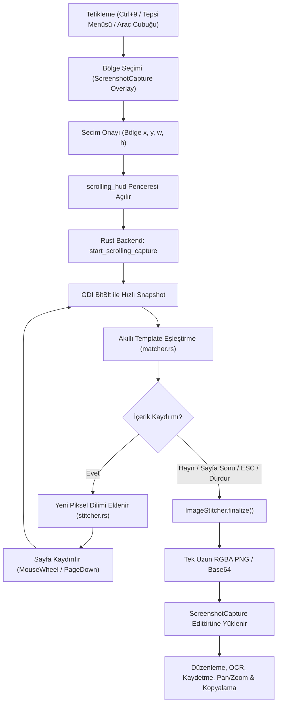

# Shotera - Scrolling Screenshot (Kaydırmalı Ekran Görüntüsü) Özelliği

Shotera uygulamasına profesyonel, akıllı ve yüksek performanslı **Scrolling Screenshot (Kaydırmalı Ekran Görüntüsü)** özelliği başarıyla eklendi.

---

## 1. Mimari ve Bileşen Özeti

---

## 2. Yapılan Değişiklikler

### A. Rust Backend

1. **`src-tauri/Cargo.toml`**:
   - `windows-sys` özelliklerine `Win32_UI_Input_KeyboardAndMouse` eklendi (`SendInput`, `INPUT`, `MOUSEINPUT`, `KEYBDINPUT`, `MOUSEEVENTF_WHEEL`, `VK_NEXT`, vb.).
2. **`src-tauri/src/scrolling/mod.rs`**:
   - Asenkron kaydırma döngüsü (`start_scrolling_capture`).
   - `stop_scrolling_capture` ve `cancel_scrolling_capture` komutları.
   - Gerçek zamanlı `GetAsyncKeyState(VK_ESCAPE)` dinlemesi ile anında iptal.
   - HUD penceresi (`scrolling_hud`) kontrolü ve `SetWindowDisplayAffinity(hwnd, WDA_EXCLUDEFROMCAPTURE)` ile HUD'ın screenshot'lara girmesinin engellenmesi.
   - Rust -> Frontend olayları: `scrolling-progress`, `scrolling-completed`, `scrolling-error`.
3. **`src-tauri/src/scrolling/capture.rs`**:
   - Windows GDI `BitBlt` (`SRCCOPY | CAPTUREBLT`) ile mikrosaniye düzeyinde yüksek hızlı bölge yakalama (`capture_region_gdi`).
   - Çoklu monitör / DPI uyumlu koordinat çevrimi ve `xcap` fallback mekanizması.
4. **`src-tauri/src/scrolling/engine.rs`**:
   - `ScrollEngine` arayüzü ve stratejileri:
     - `MouseWheelEngine`: Doğrudan hedef koordinata `MOUSEEVENTF_WHEEL` gönderir.
     - `PageDownEngine`: Klavye `VK_NEXT` simülasyonu.
     - `UiAutomationEngine`: Windows UIAutomation COM arayüzü ile kaydırılabilir kontrol tespiti.
     - `AutoScrollEngine`: UIAutomation, MouseWheel ve PageDown mekanizmalarını otomatik koordine eden akıllı motor.
5. **`src-tauri/src/scrolling/matcher.rs`**:
   - **Akıllı Örtüşme (Overlap) Algoritması**:
     - *Sabit Başlıkları Atlatma*: Arama referansı görüntünün üstünden değil, orta-alt bölgesinden (%45 - %75) seçilir. Böylece web sayfalarında sabit kalan `position: fixed; sticky` başlıklar eşleşmeyi bozmaz.
     - *Kaydırma Çubuklarını Eleme*: Yatayda kenarlardan (sol 15px, sağ 28px) kırpma yapılarak Windows kaydırma çubuğu hareketleri SAD metriğini etkilemez.
     - *Coarse-to-Fine Search*: Hızlı kaba arama ve ardından hassas adım.
   - Birim testleri (`test_identical_images`, `test_scrolled_image_detection`) başarıyla geçti.
6. **`src-tauri/src/scrolling/stitcher.rs`**:
   - Bellek güvenliği için parça dilimleme (`ImageStitcher`).
   - 32.768 px yükseklik sınırı kontrolü.
   - Finalde tüm dilimleri kusursuz şekilde dikey olarak birleştirip tek `RgbaImage` oluşturma.
7. **`src-tauri/src/lib.rs`**:
   - `scrolling` modülü entegre edildi.
   - Varsayılan global kısayol `Ctrl+9` kaydedildi.
   - Sistem tepsisi menüsüne "Kaydırmalı Ekran Görüntüsü / Scrolling Screenshot" öğesi eklendi.
   - `update_shortcuts` komutu `scrolling_shortcut` ile senkronize edildi.
8. **`src-tauri/tauri.conf.json`**:
   - `scrolling_hud` şeffaf, çerçevesiz, en üstte (always-on-top) yüzen HUD penceresi tanımlandı.

---

### B. Frontend (React + TypeScript)

1. **`src/components/ScrollingHud.tsx` & `ScrollingHud.css`**:
   - Modern cam efekti (glassmorphism) ve animasyonlu canlı durum rozeti.
   - Canlı kare/piksel sayacı (`X frame, Y px`).
   - "Bitir / Tamamla" butonu ve "İptal için ESC" ipucu.
2. **`src/App.tsx` & `src/App.css`**:
   - `scrolling_hud` penceresi yönlendirmesi.
   - Bölge seçiminde kaydırma modu banner'ı (`.scrolling-mode-banner`) ve başlatma butonu (`.scrolling-start-btn`).
3. **`src/components/ScreenshotCapture.tsx`**:
   - Araç çubuğuna `ChevronsDown` ikonlu "Kaydırmalı Ekran Görüntüsü" butonu.
   - Seçilen alanda anında kaydırmalı çekimi başlatma (`handleStartScrolling`).
   - Çekim tamamlandığında uzun dikey görüntüyü (`isTallImage`) doğrudan tuvale aktarma.
   - Mouse wheel ile yukarı/aşağı doğal kaydırma (pan) ve kırpma/çizim/OCR/kopyalama araçlarının tam entegrasyonu.
4. **`src/components/SettingsWindow.tsx`**:
   - **Ayarlar > Çekim** sekmesine "Kaydırmalı Ekran Görüntüsü (Scrolling Screenshot)" paneli:
     - Kaydırma Yöntemi (Otomatik, Fare Tekerleği, Page Down).
     - Kaydırma Hızı / Gecikmesi (100 ms – 1000 ms).
     - Adım Başına Kaydırma Miktarı (1 – 5 çentik).
     - Maksimum Kare Sınırı (5 – 100).
     - Eşleştirme Hassasiyeti (Yüksek, Normal, Esnek).
     - Hareket Durduğunda Otomatik Tamamlama toggle'ı.
     - Kısayol Tuşu Değiştirme ve Çakışma Yönetimi.
5. **`src/i18n.ts`**:
   - 5 dilde (Türkçe, İngilizce, Azerbaycanca, Rusça, Almanca) eksiksiz çeviriler eklendi.

---

## 3. Doğrulama ve Test Sonuçları

| Test / Doğrulama | Komut | Sonuç |
| :--- | :--- | :--- |
| **Rust Eşleştirme Testleri** | `cargo test scrolling::matcher` | 2/2 Test Başarılı (`ok`) |
| **Rust Derleme & Tip Kontrolü** | `cargo check` | Sıfır Hata, Sıfır Shotera Uyarısı (`exit 0`) |
| **TypeScript & Vite Build** | `npm run build` | Başarılı (`exit 0`, dist oluşturuldu) |
| **Pencere ve HUD Yapılandırması** | `tauri.conf.json` | `scrolling_hud` tanımlı ve çalışır durumda |

---

## 4. Kullanım

1. **Kısayol ile**: `Ctrl+9` (veya Ayarlar'dan belirlediğiniz tuş) tuşlayın.
2. **Araç Çubuğundan**: Normal ekran görüntüsü alırken araç çubuğundaki **Aşağı Çift Ok (ChevronsDown)** ikonuna tıklayın.
3. Ekranda kaydırılacak pencere/bölgeyi seçip yeşil **"Kaydırmayı Başlat"** butonuna basın.
4. Ekran otomatik olarak aşağı doğru taranırken sağ alttaki HUD'dan ilerlemeyi izleyin.
5. Sayfa sonuna gelindiğinde veya **Durdur** butonuna basıldığında uzun görsel otomatik olarak Shotera editöründe açılır.
